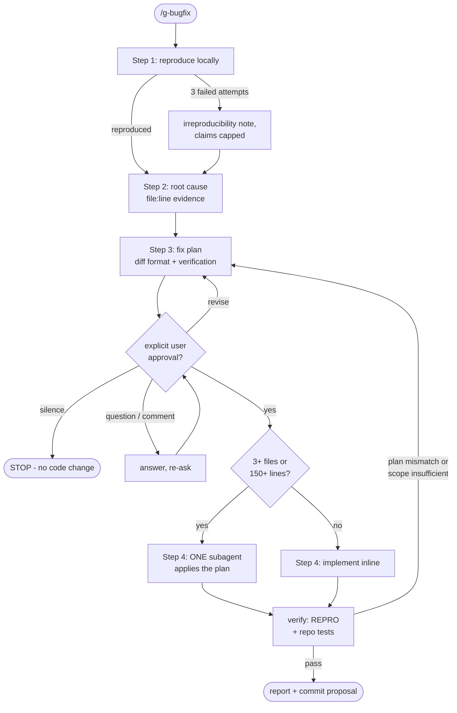

# g-bugfix

Fixes ONE bug per invocation through reproduce -> root cause -> plan ->
approval gate -> implement. No repo file is modified before the user
explicitly approves the plan. State lives in the conversation; no vault
or external state files.

## Flow Diagram

## Step Router

Every invocation starts at stage 1. Read ONLY the step file for the
current stage, in order. Never skip a stage; each step file names its
own entry condition and stops when unmet.

| Stage | Load file |
|---|---|
| 1. reproduce | `steps/step-1-reproduce.md` |
| 2. root cause | `steps/step-2-rootcause.md` |
| 3. plan + approval gate | `steps/step-3-plan.md` |
| 4. implement (post-approval) | `steps/step-4-implement.md` |

## Hard Rules

- Reproduce before diagnosing: step 2 starts only after step 1 recorded a
  reproduction command or an explicit irreproducibility note.
- Evidence discipline: per step 2's report format; every claim carries
  file:line or an unverified tag with a verification method.
- Approval gate: no Write/Edit on repo files before the user explicitly
  approves the step 3 plan. Silence, questions, or partial comments are
  not approval. Exactly two prior exceptions: the failing test written
  in step 1, and temporary debug instrumentation added in step 2
  (removed by step 4 verification).
- One bug per invocation. A second bug found on the way is reported in
  one line, never fixed in the same run.
- Delegation never widens permissions: a subagent gets the approved plan
  verbatim and only the files named in it; global agent rules apply.
