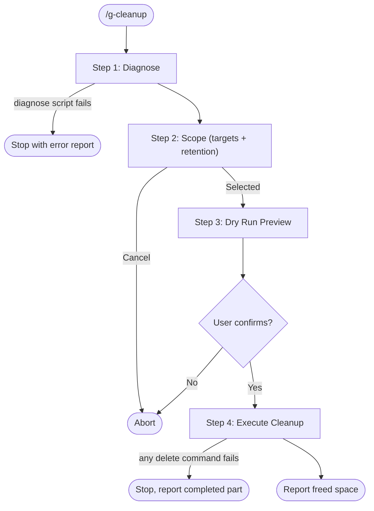

# g-cleanup Skill

Diagnose disk usage and selectively clean up ephemeral data from Claude Code and Codex CLI.

## Workflow

## References

Read these before Step 1:

- `references/protected-paths.md` - paths that must NEVER be deleted
- `references/cleanup-targets.md` - all cleanup target IDs, paths, and descriptions

## Step Router

Read ONLY the step file for the current step. Never preload other steps.

| Step | Load file | Description |
|---|---|---|
| 1 | `steps/step-1-diagnose.md` | Disk usage scan (`scripts/diagnose.sh`) + memory audit |
| 2 | `steps/step-2-scope.md` | Select targets and retention period |
| 3 | `steps/step-3-dry-run.md` | Preview what will be deleted (mandatory) |
| 4 | `steps/step-4-execute.md` | Execute cleanup after confirmation |

## Hard Rules

- Dry-run is mandatory. Never delete without the Step 3 preview and an explicit user "yes".
- Never delete protected paths. Check every deletion against `references/protected-paths.md`.
- `projects/*/memory/` content is never deleted blindly; memory issues need per-item confirmation.
- Worktrees may hold uncommitted work: confirm each one individually.
- No recursive wildcards on parent dirs: delete old items inside, never the directory itself.
- `history.jsonl` is truncated (script), never deleted.
- Runs only on explicit `/g-cleanup`. Never auto-trigger.
- Retention-based only: never touch an artifact created in the current
  session. A wrap-up request routes to /g-wrap instead.
