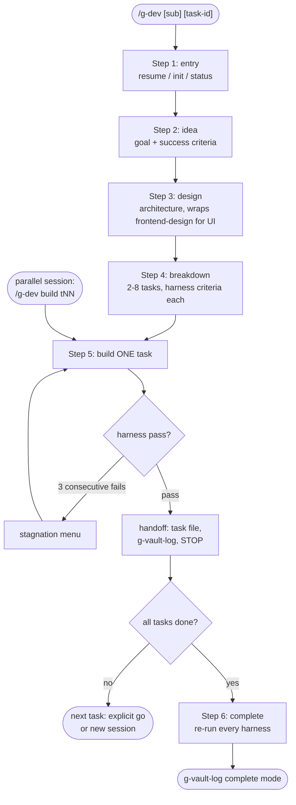

# g-dev

Runs one development project through idea -> design -> breakdown -> build ->
complete. The human-readable record is the vault's formal project doc;
machine state and task files live under `projects/<domain>/assets/<slug>/`.
Every task fixes an executable harness (commands plus expected
results) BEFORE implementation; build iterates against it.

## Flow Diagram

## Step Router

Read ONLY the step file for the requested sub-command. Steps that touch
state or task files read `references/state-format.md` first.

| Sub-command | Load file |
|---|---|
| (none) or resume | `steps/step-1-entry.md` |
| status | `steps/step-1-entry.md` (report-only) |
| idea | `steps/step-2-idea.md` |
| design | `steps/step-3-design.md` |
| breakdown | `steps/step-4-breakdown.md` |
| build [task-id] | `steps/step-5-build.md` |
| complete | `steps/step-6-complete.md` |

Entry conditions (each step checks its own; unmet -> name the missing
artifact and stop): design needs a confirmed goal section; breakdown needs
`architecture.md`; build needs at least 1 task file; complete needs every
task done, or review with only manual checks left.

## Hard Rules

- Harness before code: a task with no completion criteria never enters build.
- One task per build session. After handoff, STOP; the next task starts only
  on an explicit user go or in a separate session.
- Parallel-write safety: a build session edits only its own task file plus
  repo code. The formal doc's log and status sections are written only via
  g-vault-log; `state.md` only at step transitions.
- Vault discipline: never git commit or push inside the vault; moves and
  deletions there only after explicit user confirmation.
- External skills (frontend-design, design-taste-frontend) are wrapped by
  name per `references/external-skills.md`, never copied.
- No model names: delegate with tier classes only.
