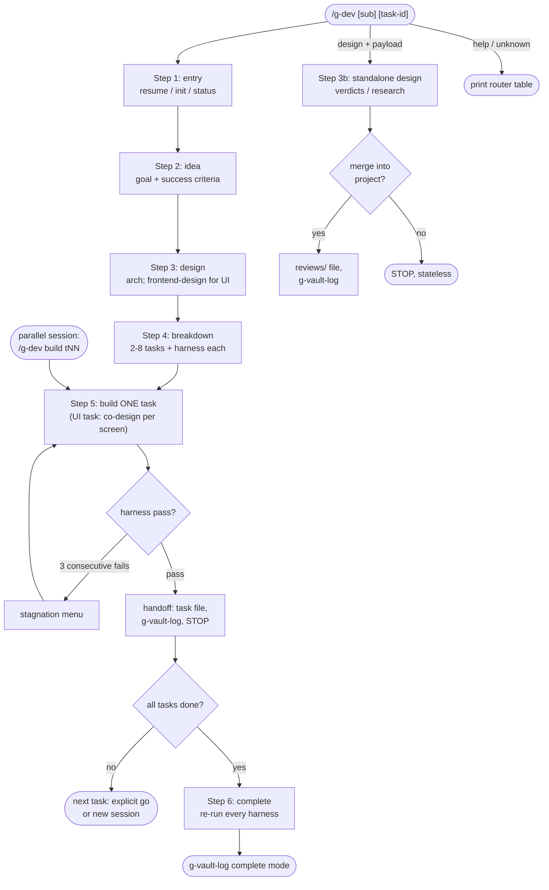

# g-dev

Human-readable record: the vault's formal project doc; machine state and
task files: `projects/<domain>/assets/<slug>/`. Every task fixes an
executable harness (commands + expected results) BEFORE implementation;
build iterates against it.

## Flow Diagram

## Step Router

Read ONLY the step file for the requested sub-command. Steps that touch
state or task files read `references/state-format.md` first.

| Sub-command | Load file |
|---|---|
| (none) or resume | `steps/step-1-entry.md` |
| no sub-command + inline payload | `steps/step-1-entry.md`; args become step 2's idea input |
| status | `steps/step-1-entry.md` (report-only) |
| idea | `steps/step-2-idea.md` |
| design | `steps/step-3-design.md` |
| design `<inline payload>` | `steps/step-3b-design-standalone.md` |
| breakdown | `steps/step-4-breakdown.md` |
| build [task-id] | `steps/step-5-build.md` |
| complete | `steps/step-6-complete.md` |
| help or unrecognized single token | print this table + one usage line, stop |

Route by the FIRST whitespace token, top-down. Token matches no row:
more text follows -> the inline-payload row; single token -> help.

Entry conditions live in each step file; unmet -> name the missing
artifact and stop.

## Hard Rules

- Harness before code: a task with no completion criteria never enters build.
- Step-entry gate: before a step's substantive work (writing files,
  implementing, or research), state in <=6 lines what it will deliver and how
  you will proceed, then get an explicit user go. `status`, `help`, and
  step-1 routing are exempt, and a step's own confirmation question (slug
  confirm, draft confirm, review gate) satisfies the gate; a
  counter-question or new option is not a go.
- One task per build session. After handoff, STOP; the next task starts only
  on an explicit user go or in a separate session.
- Parallel-write safety: a build session edits only its own task file plus
  repo code. The formal doc's log and status sections are written only via
  g-vault-log; `state.md` only at step transitions.
- Vault discipline: never git commit or push inside the vault; moves and
  deletions there only after explicit user confirmation.
- Post-handoff amendment (non-build sessions only): goal/decision changes
  = edit the goal section per step-2 D + re-invoke g-vault-log update with
  a revision summary; direct log appends only via its error fallback.
- External skills (frontend-design, design-taste-frontend) are wrapped by
  name per `references/external-skills.md`, never copied.
- No model names: delegate with tier classes only.
