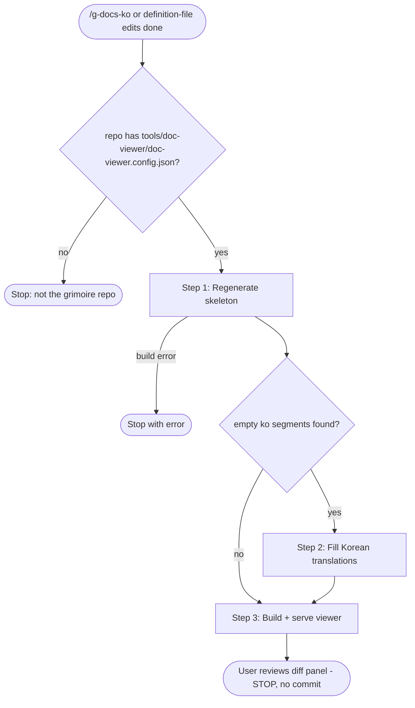

# g-docs-ko Skill

Viewer regeneration pipeline for the grimoire repo (currently
`~/Documents/GitHubPrivate/grimoire`). Produces the review state the repo
requires before committing `claude/` definition files.

## Workflow

## Preconditions

- Resolve the repo root: `git rev-parse --show-toplevel`. If
  `<root>/tools/doc-viewer/doc-viewer.config.json` does not exist, print
  `g-docs-ko runs only in the grimoire repo` and stop.
- Root name: default `grimoire`. A different root defined in
  `doc-viewer.config.json` may be passed as an argument.

## Step Router

Read ONLY the step file for the current step.

| Step | Load file | Description |
|---|---|---|
| 1 | `steps/step-1-skeleton.md` | Regenerate translation sidecars |
| 2 | `steps/step-2-translate.md` | Fill empty `ko` fields (code fences stay empty) |
| 3 | `steps/step-3-build-serve.md` | Build dist, start the viewer, hand off |

## Hard Rules

- The English source file is the only authority; sidecars are display-only.
  Never edit a source md to match a translation.
- The skill ends at "viewer ready for review". Committing is a separate
  user-approved action (CLAUDE.md commit-proposal rule).
- Never run the final `pnpm build` before Step 2 finishes: dist must include
  the new translations.
