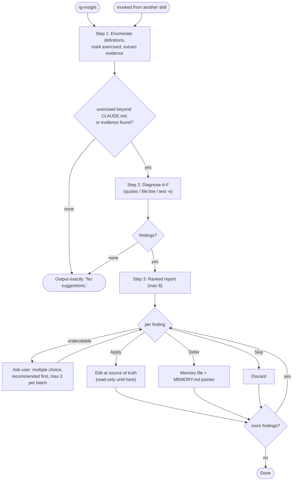

# g-insight

Session-evidence-driven audit of the definition layer. Compares what actually
happened in this session against every referable definition, reports gaps in
six fixed categories (A-F), and ends with per-finding decisions. Never reviews
project code quality. A full static audit of unexercised files is out of
scope - that belongs to a dedicated audit session.

## Flow Diagram

## Step Router

Read ONLY the step file for the current step.

| Step | Load file | Description |
|---|---|---|
| 1 | `steps/step-1-collect.md` | Enumerate the definition layer, mark exercised, extract session evidence |
| 2 | `steps/step-2-diagnose.md` | Six-category gap diagnosis with mechanical checks |
| 3 | `steps/step-3-decide.md` | Ranked report, questions, Apply / Defer / Skip |

## Hard Rules

- Evidence or silence: every finding carries a verbatim quote, a named tool
  call, or file:line. What cannot be verified is marked `미확인` with how to
  verify it - never presented as a finding.
- Read-only through Steps 1-3. Files change only after the user picks Apply
  for that specific finding.
- Standalone runs stay in the main context (the conversation IS the input; do
  not delegate evidence extraction). Invoked from another skill, it may run
  as a subagent fed that skill's task summary.
- Every Apply that touches a definition file must itself pass the
  lightweight-model test: exact commands, numeric thresholds, termination
  conditions.
