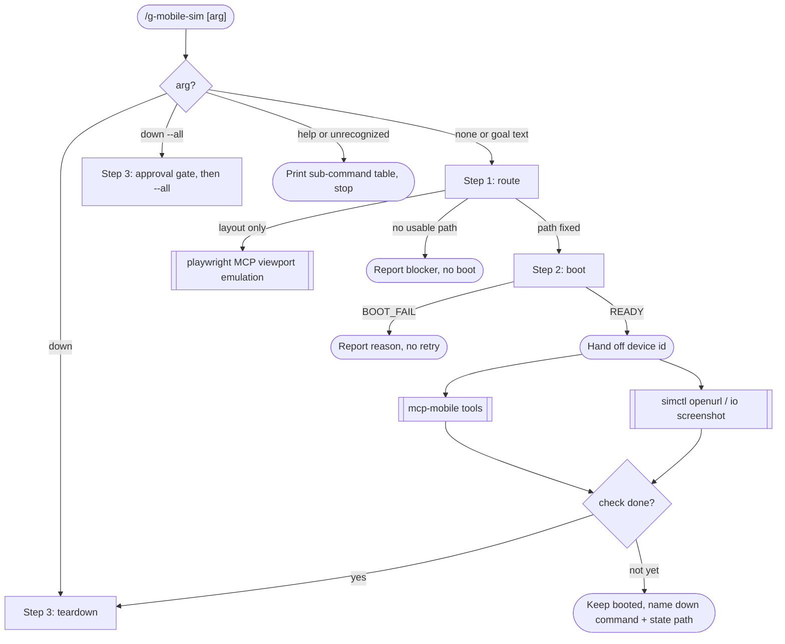

# g-mobile-sim Skill

Owns the device layer only: route, pick, boot, hand off, tear down.
Interaction (tap, type, screenshot) belongs to the external tools below.

## Workflow

## Step Router

Read only the step file for the current branch. Each step names the next one.

| Branch | Load file |
|---|---|
| route (default entry) | `steps/step-1-route.md` |
| boot | `steps/step-2-boot.md` |
| teardown (`down`, `down --all`, end of flow) | `steps/step-3-teardown.md` |

## Sub-commands

| Sub-command | Action |
|---|---|
| (none) | Default: route, then boot |
| `down` | Shut down state-file devices only |
| `down --all` | Also shut down external devices, after the step-3 gate |
| `help` | Print this table |

`help` or an unrecognized sub-command: print this table and stop. A bare
invocation runs the default flow, which asks for the goal in step 1.

## Hard Rules

- Never shut down a device absent from
  `${TMPDIR:-/tmp}/g-mobile-sim-state.tsv`. The only exception is
  `down --all`, gated by explicit approval in step 3.
- Teardown is part of the flow, not a favour: ask once when the check is done.
- Boot at most one device per path; reuse a matching state row.
- Device ids, AVD names, and LINE presence are read at runtime. Never hardcode.
- The uppercase tokens the scripts print are the contract. Each step file lists
  the ones it handles; never invent others.
- Capability matrix, WebDriverAgent status, state-file schema, token list,
  timings: `references/paths.md`.
