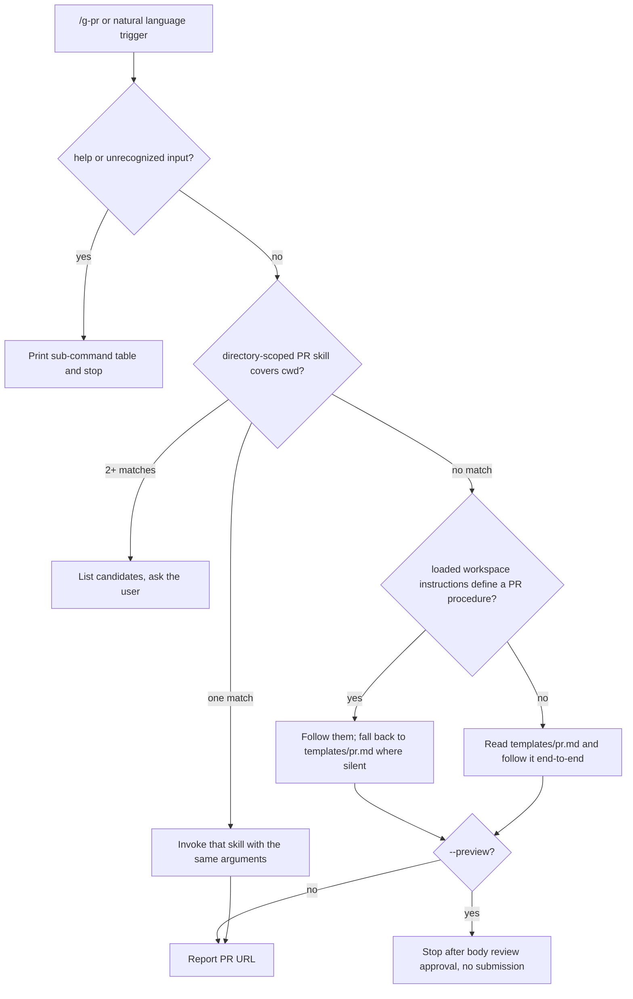

# g-pr

Router with one rule: the more specific guide wins. This skill owns no PR
logic. The user-global guide
(`~/.claude/instructions/references/templates/pr.md`) is the default;
workspace-scoped PR skills or instructions override it for their own
directories.

## Sub-commands

| Input | Action |
|---|---|
| `/g-pr` | Create draft PR (default) |
| `/g-pr <base-branch>` | Create PR targeting the given base branch |
| `/g-pr --preview` | Body review only, no submission |
| `/g-pr help` | Print this table |

Argument classification: `help` and `--preview` are literal matches. Any
other `--`-prefixed token is unrecognized. Any other single token is a
base branch when `git branch -r --list "origin/<token>"` returns a match,
otherwise unrecognized.

## Routing

1. Classify arguments (rule above); `help` or unrecognized input: print
   the sub-command table and stop.
2. Workspace override check, in order:
   a. Scan the session's available skills (excluding g-pr) for one whose
      description both declares PR creation and names a directory path
      (absolute or home-relative) that is an ancestor of the cwd.
      Exactly one match: invoke it with the same arguments and stop (it
      then owns argument interpretation, including `--preview`). Two or
      more matches: list them and ask the user which to use.
   b. If the loaded project or workspace instruction files (CLAUDE.md
      chain) define a PR creation procedure, follow it; apply the global
      guide below only where those instructions are silent.
3. No override found: Read
   `~/.claude/instructions/references/templates/pr.md` and follow its
   submission procedure and body template end-to-end.
4. `--preview`, when this skill runs the guide itself: run only base
   branch detection, change analysis, and body writing plus review; skip
   push and local verification; stop after body review approval, before
   `gh pr create`.
