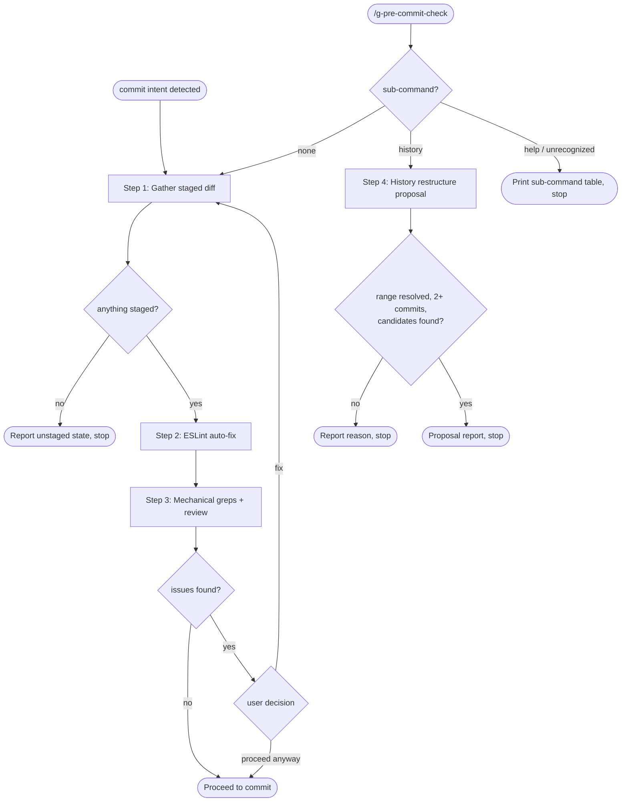

# g-pre-commit-check Skill

Self-review of staged changes before every commit. Triggered by commit intent
in the session or by explicit `/g-pre-commit-check [sub-command]`.

## Workflow

## Sub-commands

| Sub-command | Action |
|---|---|
| (none) | Staged-diff review: Steps 1-3 |
| `history` | Propose squash/reorder of unpushed commits: Step 4 only |
| `help` | Print this table and stop |

Unrecognized sub-command: print the table and stop, same as `help`.
Proactive (commit-intent) triggering always runs the default flow; `history`
runs only on explicit invocation.

## Step Router

Read ONLY the step file for the current step.

| Step | Load file | Description |
|---|---|---|
| 1 | `steps/step-1-gather.md` | Staged diff, scope classification (numeric) |
| 2 | `steps/step-2-autofix.md` | ESLint --fix on staged JS/TS files |
| 3 | `steps/step-3-review.md` | Mechanical greps + judgment checklist + report |
| 4 | `steps/step-4-history.md` | Unpushed-commit restructure proposal (`history` only) |

## Principles

- Be concise: the review takes seconds, not minutes.
- Never skip the security greps, even for a one-line diff.
- Flag, do not block: the user decides on every finding.
- This skill never runs `git commit` or history-rewriting commands (`rebase`,
  `reset`, `commit --amend`) itself; it ends at the recommendation.

## Note on enforcement

Blocking `git commit` Bash calls until this skill ran requires a PreToolUse
hook registered in settings. That hook is NOT part of this skill; without it
the triggers are this skill's description and explicit invocation.
