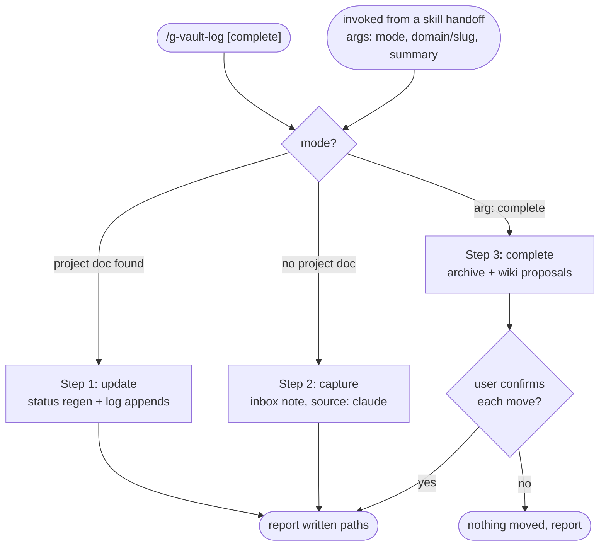

# g-vault-log

Single writer for the vault's project docs. Three modes: update (append this
session's decisions and work to a project doc), capture (no project doc:
inbox note), complete (archive move plus wiki distillation proposals). Vault
root `~/Documents/obsidian-vault`; its RULE.md is the authoritative source
for folder and frontmatter rules.

## Flow Diagram



## Mode detection

1. Argument `complete` (standalone or `complete <domain>/<slug>` from a
   skill) -> step 3.
2. A skill passed args starting with `update <domain>/<slug>` -> step 1 on
   that doc; ignore any trailing tokens, and treat an attached summary
   block as step 1's input.
3. Standalone, no args -> run the shared, worktree-safe lookup (owned by
   g-dev):

```bash
bash "$HOME/.claude/skills/g-dev/scripts/find-repo-projects.sh"
```

Script file missing -> list-and-ask. `GUARD_FAIL` -> run
`ls "$HOME/Documents/obsidian-vault/projects"`: fails -> report the
missing vault and stop; succeeds (just not a git repo) -> list-and-ask.
Exactly 1 match -> step 1 on that project's doc. 0 or 2+ matches -> list
the project docs (`ls` of `projects/dev/*.md` and `projects/work/*.md`, max
15 shown) plus the option "inbox capture", and ask. Inbox pick, or no
project docs at all -> step 2.

## Step Router

Read ONLY the step file for the detected mode.

| Mode | Load file |
|---|---|
| update | `steps/step-1-update.md` |
| capture | `steps/step-2-capture.md` |
| complete | `steps/step-3-complete.md` |

## Hard Rules

- Never git commit or push inside the vault; obsidian-git owns backup.
- Vault moves and deletions run only after explicit per-item user
  confirmation.
- Note content is Korean (vault convention); filenames English kebab-case;
  frontmatter per the vault's RULE.md. Claude-created inbox notes carry
  `source: claude`. Refresh `updated` on every doc edit.
- Record only what this session evidences (decisions with reasons, work
  with results); never invent progress.
