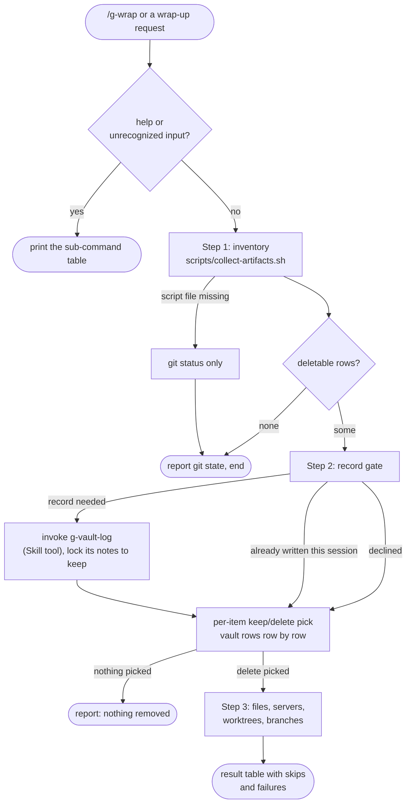

# g-wrap

Closes a session deterministically: one artifact inventory, one record
decision, one confirmed teardown. Owns the record-declined rollback path.

## Flow Diagram

## Sub-commands

| Input | Route |
|---|---|
| none | Step 1 (default action) |
| `help`, unrecognized input | print this table |

## Step Router

Read ONLY the step file for the current step.

| Step | Load file | Description |
|---|---|---|
| 1 | `steps/step-1-inventory.md` | Session window, git state, artifact surfaces |
| 2 | `steps/step-2-decide.md` | Record decision, then per-item keep/delete |
| 3 | `steps/step-3-execute.md` | Guarded deletion and result table |

## Hard Rules

- Record-declined is a delete signal, never a write signal: after the
  decline, never create, append to, relocate, or promote a vault note.
- Deletion needs an explicit pick per row. Vault rows are confirmed one row
  at a time and are never covered by a bulk approval.
- Never delete the current worktree, the current branch, or anything holding
  uncommitted or unpushed work.
- Memory files under `~/.claude/projects/*/memory/` are report-only here;
  g-cleanup owns them (`g-cleanup/references/protected-paths.md`).
- Scope is the Step 1 session window. Older artifacts belong to /g-cleanup.
- Never git commit or push inside the vault (CLAUDE.md).
