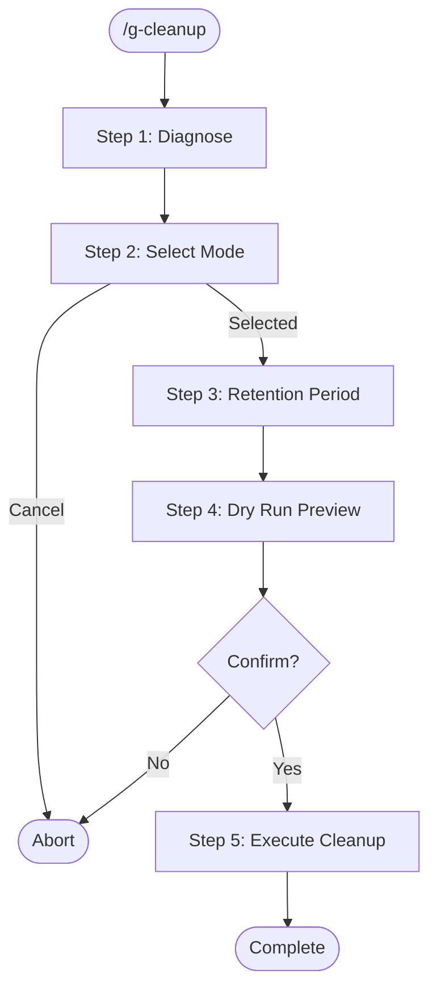

# g-cleanup Skill

Diagnose disk usage and selectively clean up ephemeral data from Claude Code and Codex CLI.

## Workflow

## References

Read these before Step 1:
- `references/protected-paths.md` — paths that must NEVER be deleted
- `references/cleanup-targets.md` — all cleanup target IDs, paths, and descriptions

## Step Router

Read ONLY the step file for the current step. Never preload other steps.

| Step | Load file | Description |
|------|-----------|-------------|
| 1 | `steps/step-1-diagnose.md` | Disk usage analysis and summary table |
| 2 | `steps/step-2-select-mode.md` | User selects All / By category / Cancel |
| 3 | `steps/step-3-retention.md` | Set retention period (default 30 days) |
| 4 | `steps/step-4-dry-run.md` | Preview what will be deleted |
| 5 | `steps/step-5-execute.md` | Execute cleanup after confirmation |

## Notes

- **Dry-run is mandatory.** Never skip the preview step.
- **Never delete protected paths.** Double-check every path against the protected list before deletion.
- **Project memory is sacred.** `projects/*/memory/` must never be touched.
- **Worktrees need special care.** They may contain uncommitted changes — always confirm individually.
- **No recursive wildcards on parent dirs.** Delete contents selectively, not entire config directories.
- **history.jsonl is truncated, not deleted.** Users may want recent history preserved.
- **This skill only runs on explicit `/g-cleanup` invocation.** Never auto-trigger.
