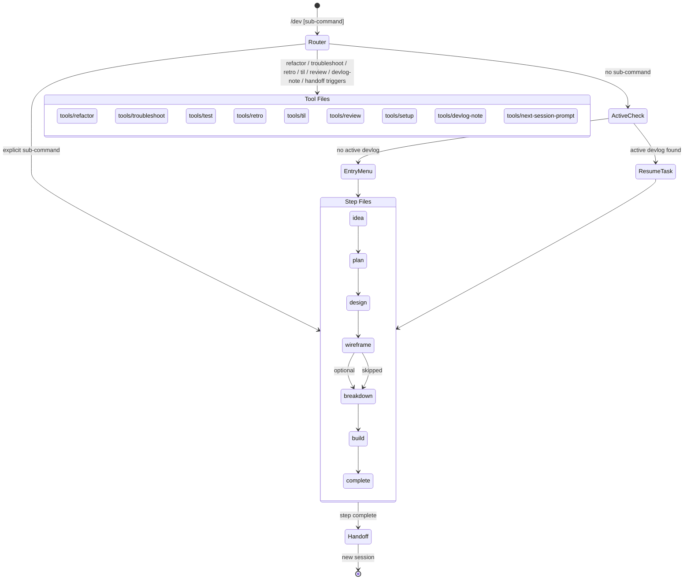

# dev — Unified Development Workflow

Single entry point for the full development lifecycle: ideation → planning → implementation → documentation.
Each sub-command maps to a step file. State persists across sessions via `_state.json` in devlogs.

---

## Role

Claude acts as a **technical project manager** in this workflow:

- **Planning phases** (idea → breakdown): drives artifact creation to a level of detail sufficient for single-session implementation without back-and-forth. Asks for clarification rather than assuming.
- **Build phase**: delegates implementation to feature-executor or Codex; owns state tracking and cross-session continuity.
- **Quality bar**: each planning artifact (PRD/TRD/breakdown) must be self-contained enough that a developer with no prior context could implement from it.

---

## Argument Pre-processing

Before routing, check if arguments were passed after `/dev`.

**Pattern detection** (in order):

| Pattern | Detection | Action |
|---------|-----------|--------|
| URL (`http://`, `https://`) | starts with `http` | Extract as artifact URL; proceed to entry.md with artifact context |
| File path (`/`, `~/`, `./`) | path-like string | Extract as artifact path; proceed to entry.md with artifact context |
| Descriptor phrase (`결과물`, `디자인`, `스펙`, `문서`, `산출물`) | keyword match | Treat arguments as artifact context; proceed to entry.md |
| Known sub-command (`idea`, `plan`, etc.) | exact match | Route normally to step file |
| No arguments | — | Proceed to entry.md (default) |

When an artifact context is detected, pass it to entry.md's "External Artifact Registration" flow rather than treating it as a sub-command.

---

## Flow Diagram



---

## Sub-command Router

Parse the first word after `/dev`. Load ONLY the matching file.

### Planning Lifecycle (devlog-tracked)

| Sub-command | Step file | Description |
|-------------|-----------|-------------|
| *(none)* | `steps/entry.md` | Active devlog check → resume or entry menu |
| `idea` | `steps/idea.md` | Ideation → brainstorm.md |
| `plan` | `steps/plan.md` | Requirements → PRD |
| `design` | `steps/design.md` | Architecture → TRD |
| `wireframe` | `steps/wireframe.md` | UI design → HTML mockup (local preview, `/tmp/`) |
| `breakdown` | `steps/breakdown.md` | Feature decomposition → features.md |
| `build` | `steps/build.md` | Feature implementation (1 feature/session) |
| `complete` | `steps/complete.md` | Wrap-up, insight, summary |
| `import` | `steps/entry.md` (Import Flow) | existing artifacts → bootstrap devlog |
| `handoff` | `Read("tools/next-session-prompt/SKILL.md")` | Generate next-session resume prompt |

### Utility Tools (devlog optional)

| Sub-command / Natural language trigger | Tool file |
|----------------------------------------|-----------|
| `test` | `Read("tools/test/SKILL.md")` |
| `refactor`, "리팩토링 해줘", "코드 정리해줘", etc. | `Read("tools/refactor/SKILL.md")` |
| `troubleshoot`, error logs, stack traces, "에러 고쳐줘", etc. | `Read("tools/troubleshoot/SKILL.md")` |
| `review`, "이 코드 리뷰해줘", "이 부분 검토해줘", "코드 봐줘", "review this", "check this code", etc. | `Read("tools/review/SKILL.md")` |
| `retro` | `Read("tools/retro/SKILL.md")` |
| `til` | `Read("tools/til/SKILL.md")` |
| `setup` | `Read("tools/setup/SKILL.md")` |
| `devlog-note`, "devlogs에 기록/정리해줘", "오늘 작업 기록해줘", "작업 노트 써줘", etc. | `Read("tools/devlog-note/SKILL.md")` |
| `status` | `steps/status.md` | scan devlogs root → print task status summary |
| `help` | inline | print available sub-commands |

### help Output Format

When `/dev help` is invoked, print the following directly (no file load):

```
/dev — Development workflow commands

Planning lifecycle (devlog-tracked):
  idea          vague concept → brainstorm.md
  plan          requirements → PRD
  design        PRD → TRD
  wireframe     TRD → HTML mockup (local preview, scenario cases)
  breakdown     TRD/wireframe → feature breakdown
  build         implement features (1 feature/session)
  complete      wrap-up + summary
  import        existing artifacts → bootstrap devlog

Utility tools (devlog optional):
  test          test code generation
  refactor      code cleanup / restructure
  troubleshoot  debug errors and stack traces
  review        code review workflow
  retro         retrospective → vault note
  til           TIL note → vault + devlog cleanup
  setup         configure lint, prettier, type-check, and husky
  devlog-note   write a note to the active devlog
  handoff       generate next-session resume prompt
  status        show all devlog task statuses

  help          show this message
```

---

## Natural Language Auto-routing

**Trigger acknowledgement:** At the start of every invocation (natural language or explicit sub-command), output on the first line:
```
> /dev → {tool-or-step}  [trigger: {explicit|natural-language: "<trigger phrase>"}]
```
Examples:
- `/dev build` 명시 호출: `> /dev → build  [trigger: explicit]`
- "에러 고쳐줘" 자동: `> /dev → troubleshoot  [trigger: natural-language: "에러 고쳐줘"]`
- "devlog에 기록해줘" 자동: `> /dev → devlog-note  [trigger: natural-language: "devlog에 기록해줘"]`

When triggered by natural language (not an explicit `/dev` command):

1. Analyze the trigger (in order):
   - Refactoring keywords → load `tools/refactor/SKILL.md` directly, skip entry menu
   - Error/debug signal (error keyword + action verb, stack trace, Sentry/log artifact,
     or performance keywords **with** log/metric artifact) → load `tools/troubleshoot/SKILL.md` directly, skip entry menu
   - Devlog write/note signal ("devlogs에 기록/정리/남겨줘", "작업 노트", "오늘 작업 기록", etc.)
     → load `tools/devlog-note/SKILL.md` directly, skip entry menu
   - Session resume/status signal:
     - "작업 현황 보여줘", "devlog 상태 보여줘" → load `steps/status.md`
     - "작업 이어하자", "이어서 진행하자" → proceed to `steps/entry.md` (resume flow)
   - Code review/modification signal ("이 코드 리뷰/검토해줘", "이 코드 봐줘",
     "코드 개선 제안해줘", "이 부분 수정 제안해줘", "review this code", "check this code")
     → load `tools/review/SKILL.md` directly, skip entry menu
   - Next-session handoff signal ("다음 세션 프롬프트", "세션 인계", "handoff prompt", etc.)
     → load `tools/next-session-prompt/SKILL.md` directly, skip entry menu
   - Generic questions without error artifact ("왜 안돼", "왜 느리지" alone) → do NOT auto-route to troubleshoot; treat as general conversation
   - Otherwise → proceed to `steps/entry.md`

2. Skip the active devlog check for utility tools (test/refactor/troubleshoot/devlog-note/review/handoff).
   They operate on the current working files or active devlog, not on the full entry flow.

---

## External Reference Behavior

When this skill is *referenced* rather than directly invoked — e.g., "'/dev' 스킬에 맞춰 정리해줘", "devlog 형식으로 저장해줘", "이 내용을 /dev 경로에 기록해줘" — from plan mode, general conversation, or another skill:

1. **Read this skill file first.** Never act on memory of the format.
2. **Resolve the devlog path** using the Devlog Path Detection rules below.
3. **Create actual files** at `<devlogs-root>/YYYY-MM-DD-<repo>-<task-name>/`. Do not reformat content inline — create the directory and individual artifact files.
4. When the user has completed artifacts, use the **Import Flow** in `steps/entry.md`.

> **Plan mode exception**: if write operations are currently blocked, record the target devlog path and artifact file list in the plan file. Create the actual files after ExitPlanMode.

---

## Devlog Path Detection

Resolve the devlogs root from `cwd`:

| cwd contains | devlogs root |
|---|---|
| `GitHubWork` | `~/Documents/GitHubWork/_claude/devlogs/` |
| `GitHubPrivate` | `~/Documents/GitHubPrivate/_claude/devlogs/` |
| neither | ask the user |

Task directory: `<devlogs-root>/YYYY-MM-DD-<repo>-<task-name>/`

**Current repo name** (used to match devlog tasks to the active project):
```bash
basename $(git rev-parse --show-toplevel 2>/dev/null || pwd)
```

---

## Session Restoration

When a sub-command is given AND `_state.json` exists in a matching task dir:

1. Read `_state.json`
2. **Migration** (apply both if needed, write once):
   - If `currentStep` is a number → convert to step name: `0→"entry"`, `1→"idea"`, `2→"plan"`, `3→"design"`, `4→"breakdown"`, `5→"build"`, `6→"complete"`, `7→"retro"`, `8→"til"`
   - If `completedSteps` contains plain strings (legacy) → convert to `{ step, at: null }` objects
   - Write updated `_state.json` before proceeding
3. If `history.md` does not exist (legacy task): create it using the initial template in `schemas/history.md`, then regenerate Current Snapshot from current `_state.json`
4. Verify all `artifacts` paths exist on disk
5. Announce: "Resuming **<taskName>** at step `<currentStep>`"
6. Load the step file for `currentStep`

When no active task context exists in the current session, run a repo-matched task search:

1. **Pass 1** — filter devlogs by current repo name (same logic as entry.md Active Task Check):
   - List folder names under the devlogs root; filter by repo name substring
   - Read `_state.json` for matched folders; identify active tasks (`currentStep NOT IN completedSteps`)
   - If active tasks found → show selection table

2. **Pass 2** — triggered only when Pass 1 finds no folder matches:
   - List all devlog folders; show to the user for cross-repo selection

3. **Selection table format:**
   ```
   현재 레포(<repo>) devlogs:

     # | Task                               | Step       | Features  | Branch
   ----+------------------------------------+------------+-----------+--------
     1 | 2026-05-19-grimoire-some-task      | build      | 3/5 done  | feat/X
     2 | 2026-05-10-grimoire-other-task     | breakdown  | —         | main

   > 번호 선택 / n 새 태스크
   ```

4. On selection: load that task's `_state.json` → apply migration if needed → proceed with the given sub-command
5. If user selects `n` (new), or no tasks exist at all: proceed as new task at the given entry point

---

## Step Router (Pre-condition Guards)

| currentStep | Load file | Pre-condition |
|-------------|-----------|---------------|
| `"entry"` | steps/entry.md | none |
| `"idea"` | steps/idea.md | none |
| `"plan"` | steps/plan.md | `artifacts.brainstorm` OR user input |
| `"design"` | steps/design.md | `artifacts.prd` exists |
| `"wireframe"` | steps/wireframe.md | `artifacts.trd` exists (may be `"skipped"`) |
| `"breakdown"` | steps/breakdown.md | `artifacts.prd` exists (trd, wireframe optional) |
| `"build"` | steps/build.md | `artifacts.features` exists |
| `"complete"` | steps/complete.md | all `features[].status == "done"` |

Verify pre-conditions before loading. If not met, warn and block.

---

## State Management

All state persists in `_state.json` within the task subdirectory.
See `schemas/state.md` for the full schema and update rules.

Key rules:
- Update `currentStep` BEFORE loading the next step file
- Register artifact paths as soon as files are created
- Append `{ step, at }` to `completedSteps` after each step completes
- Regenerate `history.md` Current Snapshot after every `_state.json` update
- idea/plan/design/breakdown end with `steps/_handoff.md`; build/complete handle handoff inline

---

## Cross-Agent Review Protocol

| Artifact | 1st Review | 2nd Review |
|----------|-----------|-----------|
| brainstorm.md | User confirmation | — |
| PRD | Plannotator + User | Codex |
| TRD / architecture | Plannotator + User | Codex |
| Feature breakdown | Plannotator + User | Codex |
| Code (Claude impl.) | Codex (`/codex:review`) | frontend-reviewer (if applicable) |
| Code (Codex impl.) | Claude (`code-reviewer` agent) | frontend-reviewer (if applicable) |

---

## External Tool Dependencies

| Tool | Purpose | Fallback |
|------|---------|----------|
| Plannotator | Visual review of PRD/TRD/features | Inline text review |
| codex-plugin-cc | Cross-review, implementation delegation | Claude-only review |
| Codex CLI | Non-interactive task delegation | Claude agent |

Never stop the workflow because a tool is missing. Fall back gracefully.

---

## Output Format

When dispatching agents, follow `agent-guidelines.md` Action Markers:
- `## 🤖 Agent: {task} ({model})` for each agent block
- Emoji action markers for tool/read/write operations
- `— parallel N/M` suffix for parallel dispatches
