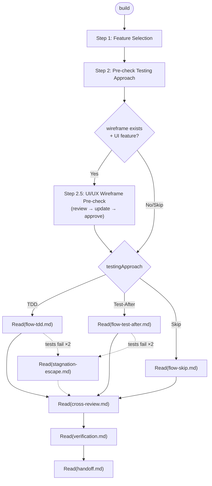

# Build: Feature Execution

Execute one feature per session. Routes to sub-files for each execution phase.

## Flow Diagram



---

## Step 1: Feature Selection

1. Read `_state.json` from the devlogs task subdirectory.
2. Display pending features:
   - Features where all `dependsOn` entries are `"done"`: selectable
   - Features with incomplete dependencies: shown as `[blocked: F-XX]`
   ```
   Pending features:
   [ ] feature-01-<name>
   [ ] feature-02-<name>        [blocked: F-01]
   ...

   Which feature would you like to work on? (enter number or name)
   ```
3. Wait for user selection.
4. Update `features[i].status` to `"in-progress"` in `_state.json`.

---

## Step 2: Pre-check — Testing Approach

1. Read `features[i].testingApproach` from `_state.json`.
2. Detect test framework on-demand (only needed for TDD and Test-After flows):
   - Check `vitest.config.*` → vitest (`pnpm test`)
   - Check `jest.config.*` → jest (`pnpm test`)
   - Check `package.json` scripts for `test` entry → use that command
   - Check `playwright.config.*` → playwright e2e (`pnpm e2e`)
   - Check `cypress.config.*` → cypress e2e
   - None found and testingApproach is not Skip → ask user for framework details
3. Proceed to the matching execution flow.

---

## Step 2.5: UI/UX Wireframe Pre-check

Skip this step entirely if **either** is true:
- `artifacts.wireframe` is `"skipped"` or `null`
- The selected feature spec contains no UI changes (pure logic, API clients, config, infra)

If both conditions are met (wireframe exists AND feature has UI changes):

1. Display the wireframe reference:
   ```
   🖥️  와이어프레임: file://<devlogs-task-dir>/wireframe.html
   관련 화면: <feature spec에서 언급된 화면/컴포넌트 목록>
   ```
2. Ask the user:
   ```
   이 기능 구현 전 와이어프레임에서 UI/UX 업데이트할 내용이 있나요?
   (있으면 변경사항 설명 / 없으면 skip)
   ```
3. **If update is needed:**
   - Modify `wireframe.html` in the devlogs task directory directly
   - Increment the version badge (v1 → v2 → ...)
   - Re-provide the same `file://` URL
   - Wait for user approval — repeat until approved
4. **If skip or approved** → proceed to Step 3

---

## Step 3: Execution Flow

Load the file matching `features[i].testingApproach`:

| testingApproach | Load file |
|---|---|
| `TDD` | `Read("steps/build/flow-tdd.md")` |
| `Test-After` | `Read("steps/build/flow-test-after.md")` |
| `Skip` | `Read("steps/build/flow-skip.md")` |

If the flow encounters stagnation (tests fail ×2): `Read("steps/build/stagnation-escape.md")`

---

## Step 4: Cross-Review

When the execution flow signals "Flow complete":

`Read("steps/build/cross-review.md")`

---

## Step 5: Verification

When cross-review is complete:

`Read("steps/build/verification.md")`

---

## Step 6: Session Handoff

When verification is complete:

`Read("steps/build/handoff.md")`
