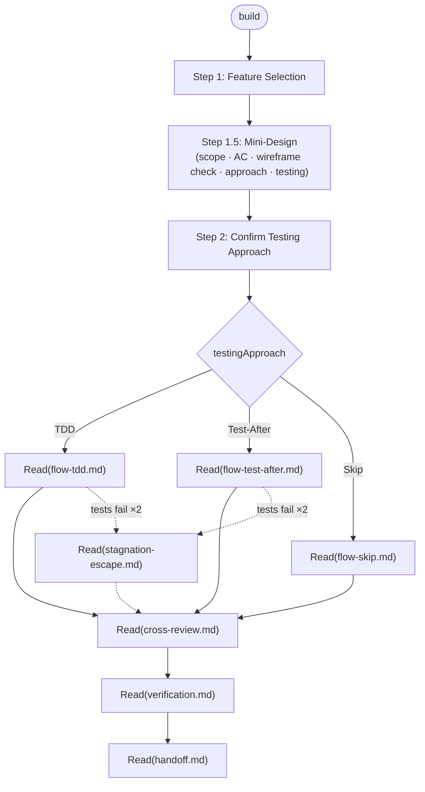

# Build: Feature Execution

Execute one feature per session. Routes to sub-files for each execution phase.

## Flow Diagram



---

## Step 1: Feature Selection

1. Read the memory file for this task.
2. Read `architecture.md` `## Features` checklist from the devlog task directory.
3. Display pending features:
   - Features with `⏳ pending` status where all `<!-- depends: F-XX -->` entries are done: selectable
   - Features with incomplete dependencies: shown as `[blocked: F-XX]`
   ```
   Pending features:
   [ ] F-01: <name>
   [ ] F-02: <name>        [blocked: F-01]
   ...

   Which feature would you like to work on? (enter number or name)
   ```
4. Wait for user selection.
5. Update the selected feature row in:
   - Memory file `## Features` table: Status → 🔄 in-progress
   - `architecture.md` `## Features`: `- [ ]` → `- [~]` (in-progress marker, optional)

---

## Step 1.5: Mini-Design

Before any implementation, define the feature concretely.
Performed inline by the orchestrator — no agent delegation.

```
## Mini-Design: F-<NN> <feature-name>

### Scope
- Files / components to create or modify
- Public interfaces (props, function signatures, API endpoints)

### Requirements (Acceptance Criteria)
- [ ] AC-1: <testable criterion>
- [ ] AC-2: ...

### Wireframe (UI feature only)
- Reference: file://<devlogs-task-dir>/wireframe.html → <screen name>
- Interaction details and state variations for this feature
- Any delta from the overall wireframe (new elements, layout changes)

### Technical Approach
- Implementation strategy
- Patterns / libraries to use
- Edge cases and error handling

### Testing
- Strategy: TDD | Test-After | Skip
- Reason: <why this approach>
- Test scope: unit only | unit + e2e | e2e only
```

After generating the mini-design, confirm once — wireframe check included:

- If `artifacts.wireframe` exists (not `"skipped"`) AND the `### Wireframe` section
  is non-empty, show the reference above the confirmation:
  ```
  🖥️  와이어프레임: file://<devlogs-task-dir>/wireframe.html
  관련 화면: <screen name from mini-design ### Wireframe>
  ```
> "Mini-design 확인. 와이어프레임에 반영할 UI/UX 변경이 있으면 함께 알려주세요. 계속할까요? (Y / 수정사항 입력)"

- Y → proceed to Step 2
- User provides changes → update the mini-design; if wireframe changes were given,
  edit `wireframe.html` directly, increment the version badge (v1 → v2), re-provide
  the same `file://` URL. Re-confirm.

The mini-design lives in the conversation context only.
If the user asks to persist it, append to `<devlogs-task-dir>/notes.md`.

---

## Step 2: Confirm Testing Approach

1. Use `testingApproach` from the mini-design (`### Testing` section).
2. Detect test framework on-demand (only needed for TDD and Test-After flows):
   - Check `vitest.config.*` → vitest (`pnpm test`)
   - Check `jest.config.*` → jest (`pnpm test`)
   - Check `package.json` scripts for `test` entry → use that command
   - Check `playwright.config.*` → playwright e2e (`pnpm e2e`)
   - Check `cypress.config.*` → cypress e2e
   - None found and testingApproach is not Skip → ask user for framework details
3. Proceed to the matching execution flow.

---

## Step 3: Execution Flow

Load the file matching the mini-design `testingApproach`:

| testingApproach | Load file |
|---|---|
| `TDD` | `Read("steps/build/flow-tdd.md")` |
| `Test-After` | `Read("steps/build/flow-test-after.md")` |
| `Skip` | `Read("steps/build/flow-skip.md")` |

If the flow encounters stagnation (tests fail ×2): `Read("steps/build/stagnation-escape.md")`

---

## Step 4: Cross-Review

When the execution flow signals "Flow complete":

`Read("steps/build/cross-review.md")`

---

## Step 5: Verification

When cross-review is complete:

`Read("steps/build/verification.md")`

---

## Step 6: Session Handoff

When verification is complete:

`Read("steps/build/handoff.md")`
