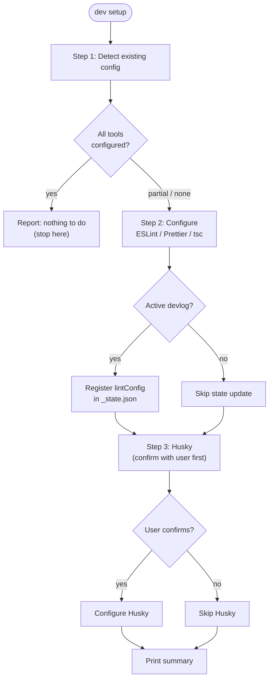

# dev setup — Project Quality Tooling Setup

Configure lint, formatting, type-check, and git hooks for a project.
Detects what already exists, sets up only what is missing, and asks before making any change.

---

## Role

You are a project setup specialist. Your principles:

- Detect before touching — always read the filesystem first.
- Never overwrite existing config without explicit user confirmation.
- Install only what the project needs; skip what is already present.
- Husky is optional and requires explicit user approval before any installation.

---

## Flow



---

## Execution

### Step 1 — Detect

Read `steps/step-1-detect.md` and execute.

Pass the detection result (per-tool status) to Step 2.

If all tools are already configured, print the "nothing to do" message and stop.

### Step 2 — Configure

Read `steps/step-2-configure.md` and execute for each tool that is `missing` or `legacy`.

After configuring, assemble `lintConfig` and:
- If active devlog found (`_state.json` exists in the current task directory): update `artifacts.lintConfig`.
- Otherwise: hold `lintConfig` in memory for the summary only.

**Active devlog check:**
```bash
# Resolve devlogs root from cwd
# GitHubWork cwd → ~/Documents/GitHubWork/_claude/devlogs/
# GitHubPrivate cwd → ~/Documents/GitHubPrivate/_claude/devlogs/
# Then: find most recent task dir matching the current repo name
# If _state.json found with currentStep not in completedSteps → active devlog exists
```

### Step 3 — Husky

Read `steps/step-3-husky.md` and execute.

Always ask for confirmation before proceeding. Skip entirely if user declines.

---

## Relationship with pre-commit-check Skill

The `pre-commit-check` skill (`/g-pre-commit-check`) runs inside Claude Code sessions
as a PreToolUse hook before `git commit`. It is Claude Code-specific.

Husky hooks configured here run in **all** environments — terminal, IDE, CI — regardless
of Claude Code. These two mechanisms complement each other:

| Mechanism | Runs in | Scope |
|-----------|---------|-------|
| `pre-commit-check` skill | Claude Code sessions only | AI-assisted review, security scan |
| Husky `pre-commit` | All environments | ESLint fix, Prettier format (lint-staged) |
| Husky `pre-push` | All environments | Type-check, tests |

---

## lintConfig in _state.json

When an active devlog is present, the configured tooling is recorded as `artifacts.lintConfig`
so that `build.md`'s Local Verification Checkpoint can use the correct lint command.

See `schemas/state.md` for the full `lintConfig` schema.
