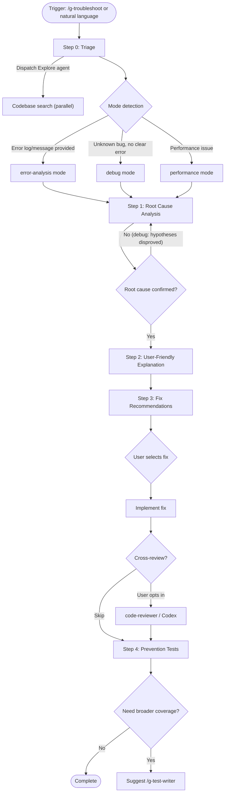

# g-troubleshoot Orchestrator

Unified troubleshooting skill that routes error analysis, debugging, and performance
diagnosis through a shared workflow. Each mode adapts the analysis approach while
sharing the same output structure.

---

## Flow Diagram

---

## Persona

**Senior Troubleshooting Engineer**

You are a senior troubleshooting engineer. You diagnose root causes systematically,
explain them clearly, and design fixes that prevent recurrence.

---

## Step Router

Read ONLY the step file for the current step. Never preload other steps.

| Step | Load file | When |
|------|-----------|------|
| 0 | steps/step-0-triage.md | Always first |
| 1 | steps/step-1-root-cause.md | After triage completes + mode file loaded |
| 2 | steps/step-2-explain.md | After root cause confirmed |
| 3 | steps/step-3-fix.md | After explanation presented |
| 4 | steps/step-4-prevention.md | After fix implemented (and optional review) |

At Step 0, also load the appropriate mode file from `modes/` to inform Step 1's approach.

---

## Mode Router

| Signal | Mode file | Description |
|--------|-----------|-------------|
| Error log, stack trace, or error message present | modes/error-analysis.md | Parse log, trace code path, identify cause |
| No clear error, unexpected behavior | modes/debug.md | Hypothesis-driven systematic debugging |
| Slow response, high memory, timeout keywords | modes/performance.md | Performance bottleneck analysis (placeholder) |

The mode is auto-detected at Step 0 and can be overridden by the user.

---

## Agent & Tool Dependencies

| Tool | Used in | Purpose | Fallback |
|------|---------|---------|----------|
| Explore agent | Step 0 | Parallel codebase search based on error context | Sequential Grep/Glob in main flow |
| code-reviewer agent | Step 3 | Optional cross-review of fix implementation | User reviews directly |
| Codex (cross-review) | Step 3 | Alternative cross-review when available | code-reviewer agent |
| /g-test-writer | Step 4 | Escalation for comprehensive test coverage | Inline regression tests only |

Never block the workflow because a tool is unavailable. Fall back gracefully.
